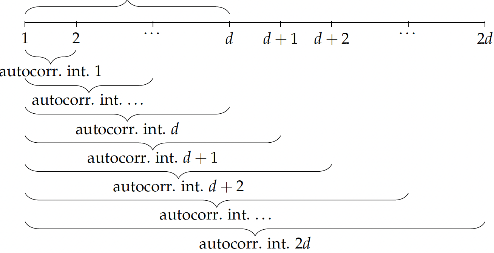

# Estimating the acoustic environment from recorded speech

## NON-TECHNICAL EXPLANATION

Non-studio audio always contains traces of the acoustic environment it's been recorded in. These traces are sufficiently unique to form a signature characteristic, representing a room or a building. Numerically, the trace (a 'fingerprint') of the acoustic environment can be represented as a short sequence of numbers, representing what the acoustic environment does to the signal.

This algorithm analyses the recording to try and estimate the environment 'fingerprint'. It can be used as a building block for further work in building a classifier, based on these estimates.

## DATA

The algorithm uses a dataset of artificially reverberated speech utterances.

The speech utterances are a subset of the DARPA TIMIT acoustic-phonetic continuous speech corpus.
The artificially reverberated versions of the speech utterances are obtained using a subset of the Open Acoustic Impulse Response Library.

For this dataset:
- the training set is a subset of 41 speech utterances selected from the TIMIT data set, and each utterance has been artificially reverberated using one of the 7 impulse responses from the OpenAIR data set, giving 287 samples.
- the validation set is a subset of the same 41 speech utterances, reverberated with an additional 49 impulse responses also obtained from the OpenAIR data set, giving 2009 samples.

## MODEL 

I'm optimising my own model which I’ve developed for the purpose of detecting and classifying reverberation patterns in speech utterances.

The model is analytical, based on a sequence of averaged and binned autocorrelation metrics on the first-order derivative of the signal.

Top level block diagram of the model:

In the model, autocorrelation is calculated
over a number of uniformly spaced intervals, ranging from 2ms to 2$d$ms, where $d$ is the chosen interval length.

The data calculated for each autocorrelation interval from 2ms to 2$d$ms is accumulated. This
data is used to construct a weighted histogram of early reflection arrival times.

In the histogram, the bin heights correspond to early reflection normalised intensities. The
bin widths are set to 1ms and the overall period covered by the histogram is set to $d$ms. Any
autocorrelation peak data indicating early reflection arrival times later than $d$ms is mapped
into the $d$-th histogram bin.

The resulting histogram is used as a fingerprint descriptor of the early reflections found in
the reverberated speech signal.

$|\Delta_2|$ is the first-order derivative of the signal.

The similiarty metric is a weighted combination of two
partial scores:
- a measure which is taking into account the histogram bin heights (measure A). This measure reflects the ability of the
algorithm to estimate the relative intensities of the detected peaks,
- a measure which is not taking into account the histogram bin heights, only which bins
are non-zero (measure B). This measure reflects the ability of the algorithm to pinpoint
the exact time of the detected peaks.

Measure A is calculated as a truncated cosine similarity measure.

Measure B is a further weighted combination of two partial scores:
- a measure of incompleteness
- a measure of false positiveness

The overall score is a simple arithmetic mean of all partial scores.

## HYPERPARAMETER OPTIMISATION

I have chosen three parameters of the algorithm to be optimised for:
- the number of neighbour samples in the delta signal
- the number of cross correlation intervals
- the minimum peak prominence

Some of the hyperparameters are categorical, rather than continuous floating point.

I use a simple normalisation function for the purpose of mapping the categorical parameters to a continuous range of 0..1. I feed the normalised parameter values into the Bayesian Optimisation algorithm.

To use the outputs from the BO algorithm, I map the values back from the continuous range of 0..1 to the original range, used in the model.

I run two types of BO algorithms to do the optimisation:
- a simple grid based search with Probability of Improvement acquisition function
- the Leaf-GP algorithm adapted from https://github.com/cog-imperial/tree_kernel_gp. This is used for the second stage of the black box optimisation.

## RESULTS

This is a comparison of how the model performs using the initial and the optimised parameter set, on the training data set. The parameters which are used as the baseline for comparison have been found earlier through manual tuning:

Baseline y:  [0.57456446]
Optimised y:  [0.58292683]

This is a comparison of how the model performs using the initial and the optimised parameter set, on the training validation set. The optimised parameter set increases the algorithm accuracy for both the test and the validation data set:

Baseline y:  [0.65569935]
Optimised y:  [0.68317571]

