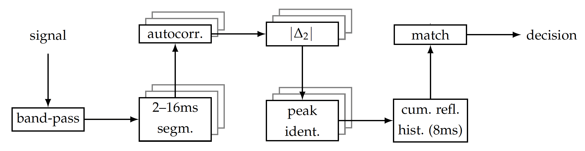
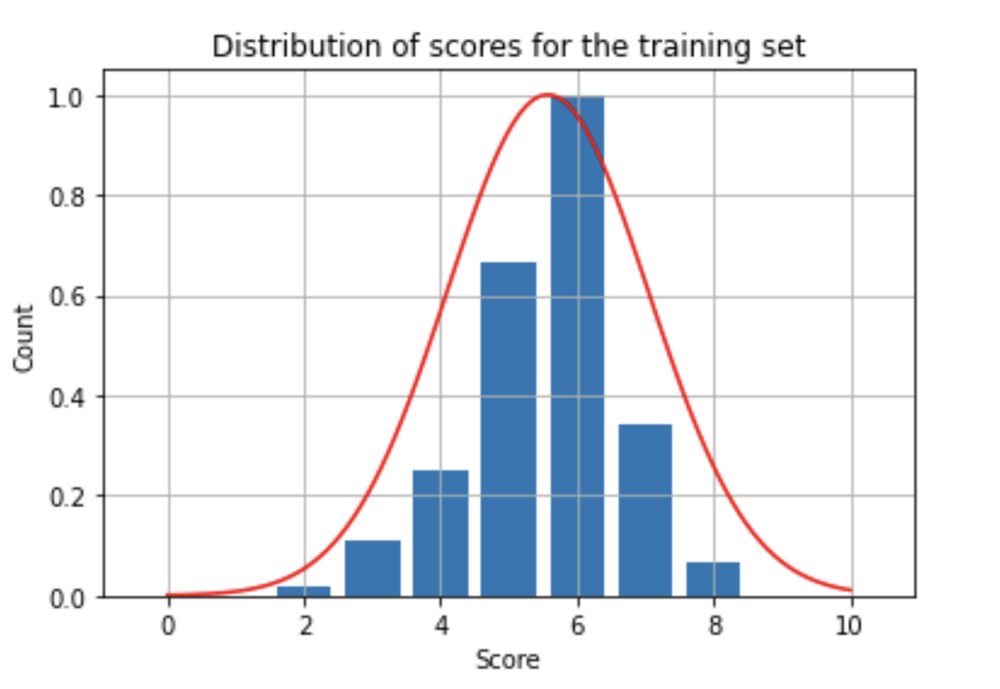
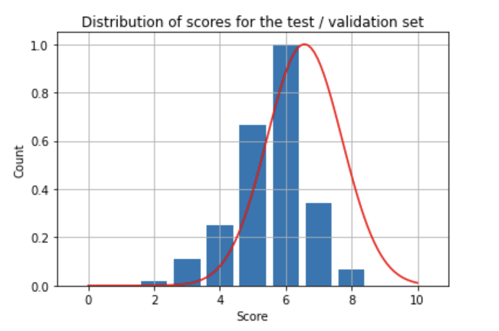

# Model Card

## Model Description

**Input:**

The inputs to the model are artificially reverberated speech utterances, digitised into WAV (Wave Audio) file format.

**Output:** 

The output from the model is a sequence of eight numbers, normalised to 1.0. The numbers represent the fingerprint descriptor of the acoustic environment found in the reverberated speech signal.

**Model Architecture:**

The model is analytical, based on a sequence of averaged and binned autocorrelation metrics on the first-order derivative of the signal.

Top level block diagram of the model:

In the model, autocorrelation is calculated
over a number of uniformly spaced intervals, ranging from 2ms to 2$d$ms, where $d$ is the chosen interval length.

The data calculated for each autocorrelation interval from 2ms to 2$d$ms is accumulated. This
data is used to construct a weighted histogram of early reflection arrival times.

The resulting histogram is used as a fingerprint descriptor of the early reflections found in
the reverberated speech signal.

## Performance

The performance of the model is measured using a similiarty metric which is a weighted combination of two
partial scores:
- a measure which is taking into account the histogram bin heights (measure A). This measure reflects the ability of the
algorithm to estimate the relative intensities of the detected peaks,
- a measure which is not taking into account the histogram bin heights, only which bins
are non-zero (measure B). This measure reflects the ability of the algorithm to pinpoint
the exact time of the detected peaks.

Measure A is calculated as a truncated cosine similarity measure.

Measure B is a further weighted combination of two partial scores:
- a measure of incompleteness
- a measure of false positiveness

The overall score is a simple arithmetic mean of all partial scores.

The performance numbers representing the accuracy of the model are:
- on the training data set: 58%
- on the validation data set: 68%
- overall: 63%

Score distributions for the training data set:

Score distributions for the test data set:

## Limitations and Trade-offs

The model has not been tested in adversarial conditions, such as with the presence of background noise.

The model's sensitivity has been tuned to indoor acoustic environments, exhibiting relatively strong reflections. The model should not be used for recordings made in outdoor conditions, or otherwise where the presence of the acoustic environment is not prominent.

The model makes the assumption that the spoken utterance starts with an unvoiced stop consonant, and should not be used otherwise.